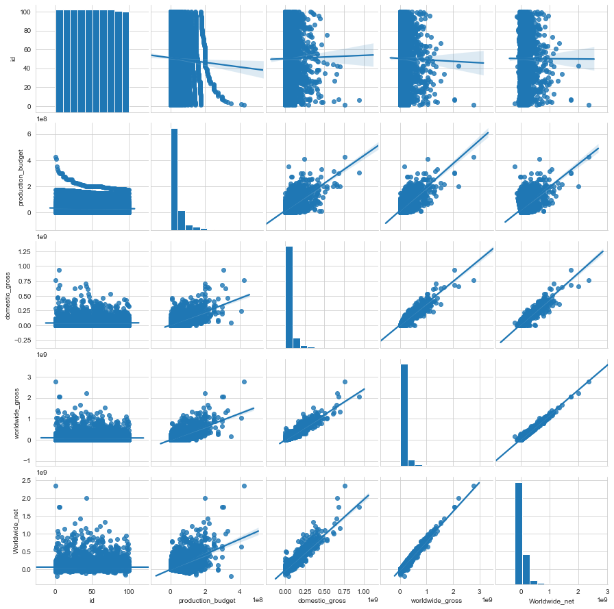

# Module 1 Final Project

## Introduction

Lorem ipsum dolor sit amet, consectetur adipisicing elit, sed do eiusmod tempor incididunt ut labore et dolore magna aliqua. Ut enim ad minim veniam, quis nostrud exercitation ullamco laboris nisi ut aliquip ex ea commodo consequat. Duis aute irure dolor in reprehenderit in voluptate velit esse cillum dolore eu fugiat nulla pariatur. Excepteur sint occaecat cupidatat non proident, sunt in culpa qui officia deserunt mollit anim id est laborum.

## Objectives

This project explores the following questions and why:

* Lorem ipsum dolor sit amet, consectetur adipisicing elit
* sed do eiusmod tempor incididunt ut labore et dolore magna aliqua
* Ut enim ad minim veniam, quis nostrud exercitation ullamco laboris nisi ut aliquip ex ea commodo consequat
* Duis aute irure dolor in reprehenderit in voluptate velit esse cillum dolore eu fugiat nulla pariatur

# The Dataset

Project data resources provided for this project included movie-related data from:
* Box Office Mojo
* IMDB
* Rotten Tomatoes
* TheMovieDB.org

# Featured Notebooks/Analysis
* `student`: **Jupyter Notebook** containing code written for this project and comments explaining it.
* `movies-q1`: Top Grossing Titles
* `movies-q2`: Top Performing Studios
* `movies-q3`: Performance by Genre
* `movies-data-conditioning`:
* `movies-clean-transform`:

#### Visualizations & EDA

* visualizations, with corresponding interpretations.

### Non-Technical Presentation

* summarizing  methodology and findings
